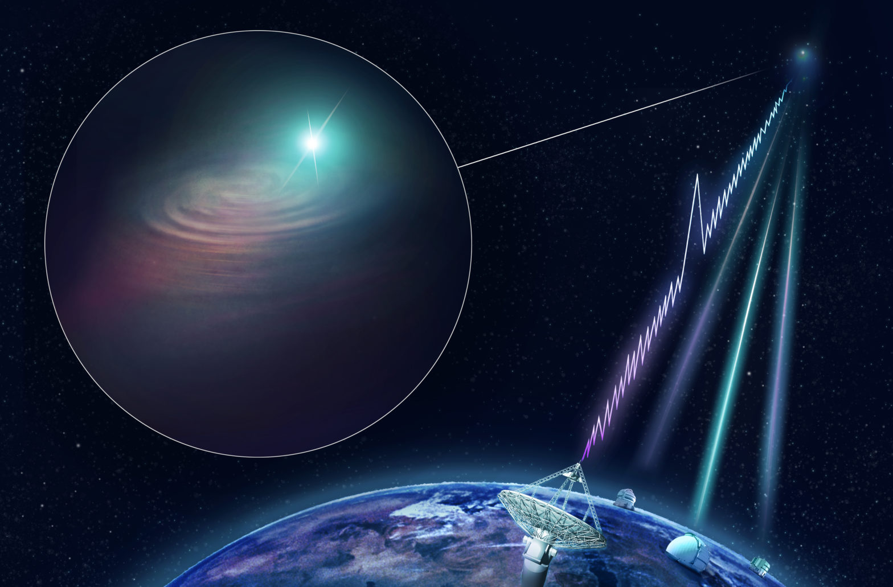

# GALFRB

Welcome to the GALFRB repository!

<p align="center">
  
  <br>
  <sub><em>Artist’s impression of CSIRO’s Australian SKA Pathfinder (ASKAP) radio telescope finding a fast radio burst and determining its precise location. The KECK, VLT and Gemini South optical telescopes joined ASKAP with follow-up observations to image the host galaxy. Credit: CSIRO/Dr Andrew Howells</em></sub>
</p>


## Description

GALFRB is a project aiming to unveiling the origing of Fast Radio Bursts (FRBs) by modeling their hosts' properties. With improved localization precision a considerable amount of FRBs are now associated with host galaxies. Their stellar mass $M_\star$ and star formation (SF) distribution encode important information related to the formation channel of FRBs.

This repository contains flexible modules for generating joint distributions of the properties of mock galaxies to compare with FRB hosts and provide stringent constraints on their origin. \textit{Not limited to FRBs, this code can be also applied to studies of any kind of transient, extragalactic phenomena (e.g., gamma-ray bursts), so long as their host galaxies are identified.}

## Installation and Usage

To get started with GALFRB, follow these steps:

### Installation through `conda`

1. Clone the repository: `git clone https://github.com/loudasnick/GALFRB.git`
2. Navigate to GALFRB directory: `cd GALFRB/`
3. Create a new conda environment devoted to executing GALFRB: `conda create -n GALFRB_evn python==3.8.19 ipykernel`
4. Activate conda env: `conda activate GALFRB_evn` <!-- 2. Install the required dependencies: `pip install -r requirements.txt` -->
5. Install required libraries: `pip install -r requirements.txt`
6. Install GALFRB: `pip install -e .`
7. Download SDSS+WISE galaxy catalog (used in modeling the probability density in color-sfr plane): `python download_sdss_wise_data.py`
8. Run the tutorial found in `examples/` to verify the correct installation of the package


### Installation through `pyenv`

1. Clone the repository: `git clone https://github.com/loudasnick/GALFRB.git`
2. Navigate to GALFRB directory: `cd GALFRB/`
3. Install necessary python version `pyenv install 3.8.18`
4. Create a virtual environment devoted to executing GALFRB: `pyenv virtualenv 3.8.18 GalFRB`
5. Activate virtual env: `pyenv activate GalFRB`
6. Install required libraries: `pyenv exec pip install -r requirements.txt`
7. Install GALFRB: `pyenv exec pip install -e .`
8. Download SDSS+WISE galaxy catalog (used in modeling the probability density in color-sfr plane): `python download_sdss_wise_data.py`
9. Run the tutorial found in `examples/` to verify the correct installation of the package


You are all set!

## Main module for generating mock galaxy samples


```python
# load the main modules of GALFRB
from galfrb import generator as GFRB
```

This will display the code in a monospaced font and preserve the formatting. You can also specify the programming language after the opening backticks to enable syntax highlighting. For example, to highlight Python code, use ```python```:

```python
GFRB.mock_realization()
```

Input parameters of `mock_realization()` routine:

- `zbins`: the redshift values separating the bins (number of bins = len(zbins) - 1)
- `zgal`: the redshift at which each mock galaxy lies for each bin (applicable and useful only when space_dist='delta')
- `Nsample`: number of mock galaxies per mock galaxy realization and per redshift bin
- `weight`: weight function to be used in the sampling distribution function (current options: 'SFR', 'mass', 'uniform')
- `save`: flag for storing the figure
- `mfunc_ref`: Which stellar mass function to be implemented in the calculation (current options: 'Leja', 'Schechter')
- `mfunc_slope`: slope coefficient for artificially changing the stellar mass-function slope (default: 0, i.e., no modification of the stellar mass function)
- `mfunc_Mstar0`: stellar-mass coefficient below which the stellar mass slope changes artificially (only if mfunc_slope!=0)
- `sfr_ref`: Which SFR-Mstar-z probability density to be used [current options: 'Speagle', 'Leja']
- `mode`: which mode of the sfr-Mstar parametric formula to be considered (available: 'ridge', 'mean', 'nn') ('nn' corresponds to the probability density offered by the trained normalizing flow of Leja+2022; it also needs `posterior=True`)
- `posterior`: If True, then sampling of the posterior in the SFR-Mstar-z is activated,
- `plot_cdf_ridge`: Flag to activate plotting of the cdf curved computed using `mode='ridge'`, i.e., no posterior, for comparison purposes 
- `completeness_handling`: `if mode='nn'`, then it determines the prescribed sfr-mass relationship below m_completeness (current options: 'sharma-like', 'hybrid', 'cutoff')
- `sigma_norm`: it controls the spread in the sfr-mass below m_completeness (only if `completeness-handling='hybrid'`)
- `n_realizations`: how many different samples from the posterior are to be generated per redshift bin
- `transparency`: 'alpha' for each line in the plot
- `data_source`: FRB host galaxy sample (current options: 'Sharma_only', 'Sharma_full')
- `ks_test`: If True, the Kolmogorov-smirnoff test is carried out
- `sfr_sampling`: flag to sample sfr value for each mock generated galaxy (used to obtain color)
- `space_dist`: Distribution of mock galaxies in space (current options: 'uniform-vol', 'delta', 'uniform-z'). The 'uniform' mode is outdated.
- `z_min`: array of min redshift value in each redshift bin
- `z_max`: array of max redshift value in each redshift bin
- `p_dens_params`: various parameters used to sample the PDF in logm-logsfr-z,
- `p_prob_arr`: PDF in logm-logsfr-z space (Leja et al. 2022) 
- `p_z_arr`: redshift array in logm-logsfr-z grid space 
- `p_logm_arr`: logM array in logm-logsfr-z grid space 
- `p_logsfr_arr`: logsfr array in logm-logsfr-z grid space 
- `ml_sampling`: If mass-to-light ratio is to be sampled. (current options: 'gaussian', 'prescribed', 'advanced'. The advanced is the one described in Loudas et al. 2025)
- `prescribed_ml_func`: Prescribed lambda function to compute M/L for given sfr, sfr_mode, it is used only if `ml_sampling='prescribed'`
- `density_sfr_color`: prob. density in sfr-color plane provided M/L sampling is activated
- `sfr_grid`: sfr array (in log form) for sfr-color grid resolution provided M/L sampling is activated
- `color_gr_grid`: color g-r array for sfr-color grid resolution provided M/L sampling is activated
- `Kr_correction`: flag to activate and implement Kr-correction
- `plot_M_L`: flag to plot the mass-to-light distribution and other related quantities
- `store_output`: flag to store all samples into an h5 data file


## Contributing

We welcome contributions from the community! 

## License

This project is licensed under the [MIT License](LICENSE).
