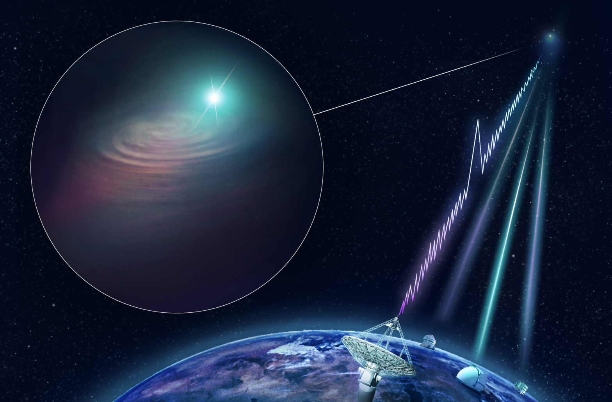

# GALFRB

[](https://doi.org/10.5281/zenodo.16069660)

Welcome to the GALFRB repository! 

<p align="center">
  
  <br>
  <sub><em>Artist’s impression of CSIRO’s Australian SKA Pathfinder (ASKAP) radio telescope finding a fast radio burst and determining its precise location. The KECK, VLT and Gemini South optical telescopes joined ASKAP with follow-up observations to image the host galaxy. Credit: CSIRO/Dr Andrew Howells</em></sub>
</p>


## Description

GALFRB is a project aiming to unveiling the origin of Fast Radio Bursts (FRBs) by modeling their hosts' properties. With improved localization precision a considerable amount of FRBs are now associated with host galaxies. Their stellar mass $M_\star$ and star formation (SF) distribution encode important information related to the formation channel of FRBs.

This repository contains flexible modules for generating joint distributions of the properties of mock galaxies to compare with FRB hosts and provide stringent constraints on their origin. *Not limited to FRBs, this code can be also applied to studies of any kind of transient, extragalactic phenomena (e.g., gamma-ray bursts), so long as their host galaxies are identified.*

The main paper of this project can be found here: [Unveiling the origin of fast radio bursts by modeling the stellar mass and star formation distributions of their host galaxies](https://arxiv.org/abs/2502.15566). 

## Physical model overview

GALFRB constructs mock galaxy populations using:

- Stellar mass function (Leja / Schechter variants)
- SFR–M⋆–z relations (ridge / mean / neural network posterior)
- Color–SFR probabilistic mapping
- Mass-to-light modeling with redshift dependence


## Installation

To get started with GALFRB, follow these steps:

### Installation through `conda`

1. Clone the repository: `git clone https://github.com/loudasnick/GALFRB.git`
2. Navigate to GALFRB directory: `cd GALFRB/`
3. Create a new conda environment devoted to executing GALFRB: `conda create -n GALFRB_evn python==3.8.19 ipykernel`
4. Activate conda env: `conda activate GALFRB_evn` <!-- 2. Install the required dependencies: `pip install -r requirements.txt` -->
5. Install required libraries: `pip install -r requirements.txt`
6. Install GALFRB: `pip install -e .`
7. Download SDSS+WISE galaxy catalog (used in modeling the probability density in color-sfr plane): `python download_sdss_wise_data.py`
8. Run the tutorial found in `examples/` to verify the correct installation of the package


### Installation through `pyenv`

1. Clone the repository: `git clone https://github.com/loudasnick/GALFRB.git`
2. Navigate to GALFRB directory: `cd GALFRB/`
3. Install necessary python version `pyenv install 3.8.18`
4. Create a virtual environment devoted to executing GALFRB: `pyenv virtualenv 3.8.18 GalFRB`
5. Activate virtual env: `pyenv activate GalFRB`
6. Install required libraries: `pyenv exec pip install -r requirements.txt`
7. Install GALFRB: `pyenv exec pip install -e .`
8. Download SDSS+WISE galaxy catalog (used in modeling the probability density in color-sfr plane): `python download_sdss_wise_data.py`
9. Run the tutorial found in `examples/` to verify the correct installation of the package


You are all set!

## Main module for generating mock galaxy samples


```python
# load the main modules of GALFRB
from galfrb import generator as GFRB
```
Subsequently call the `mock_realization` module with the desired input parameters
```python
GFRB.mock_realization()
```

Input parameters of `mock_realization()` routine:

- `zbins`: redshift-bin edges (`number of bins = len(zbins) - 1`)
- `zgal`: representative redshift(s) for each bin. For `space_dist='delta'` or `'delta_at_zright'`, this specifies the redshift where galaxies are placed
- `Nsample`: number of mock galaxies generated per realization and per redshift bin
- `weight`: weighting scheme used in the sampling distribution (`'SFR'`, `'mass'`, `'uniform'`)
- `save`: flag to save generated figures
- `mfunc_ref`: stellar mass-function prescription (`'Leja'`, `'Schechter'`)
- `mfunc_slope`: artificial modification applied to the low-mass slope of the stellar mass function
- `mfunc_mstar0`: stellar-mass threshold below which the modified slope is applied
- `sfr_ref`: star-forming main-sequence prescription (`'Speagle'`, `'Leja'`)
- `mode`: mode of the SFR--stellar-mass relation (`'ridge'`, `'mean'`, `'nn'`)
    - `'nn'` uses the normalizing-flow posterior model of Leja et al. (2022)
- `posterior`: if `True`, samples realizations from the posterior distribution
- `plot_cdf_ridge`: if `True`, also plots the ridge-line CDF for comparison
- `completeness_handling`: treatment of the SFR--mass relation below the completeness limit when `mode='nn'`
    - available options: `'hybrid'`, `'cutoff'`, `'sharma-like'`
- `sigma_norm`: controls the SFR scatter below the completeness limit (relevant for `'hybrid'`)
- `n_realizations`: number of posterior realizations generated per redshift bin
- `transparency`: transparency (`alpha`) value used for posterior realizations in plots
- `data_source`: FRB host-galaxy sample used for comparison (`'Sharma_only'`, `'Sharma_full'`)
- `ks_test`: if `True`, performs a Kolmogorov--Smirnov test between mock galaxies and FRB hosts
- `sfr_sampling`: if `True`, samples SFR values for each mock galaxy (required for color and mass-to-light calculations)
- `space_dist`: spatial/redshift distribution of mock galaxies
    - available options:
        - `'delta'`: all galaxies placed at `zgal`
        - `'delta_at_zright'`: galaxies placed at the upper redshift edge
        - `'uniform-z'`: galaxies uniformly distributed in redshift
        - `'uniform-vol'`: galaxies uniformly distributed in comoving volume
- `nz_bins`: number of sub-redshift bins used when `space_dist` is not delta-function based
- `z_min`: lower redshift limits for each bin (used in non-delta spatial distributions)
- `z_max`: upper redshift limits for each bin (used in non-delta spatial distributions)
- `p_dens_params`: dictionary containing parameters defining the posterior PDF grid in `(logM, logSFR, z)` space
- `p_prob_arr`: posterior probability-density array in `(logM, logSFR, z)` space
- `p_z_arr`: redshift grid corresponding to `p_prob_arr`
- `p_logm_arr`: stellar-mass grid corresponding to `p_prob_arr`
- `p_logsfr_arr`: SFR grid corresponding to `p_prob_arr`
- `ml_sampling`: mass-to-light ratio prescription
    - available options:
        - `'prescribed'`
        - `'advanced'`
- `prescribed_ml_func`: user-defined lambda/function used to compute mass-to-light ratios when `ml_sampling='prescribed'`
- `bimodal_gr`: activates a bimodal rest-frame `(g-r)` color distribution (`ml_sampling='advanced'` only)
- `all_red`: forces all galaxies to belong to the red population (`ml_sampling='advanced'` only)
- `all_blue`: forces all galaxies to belong to the blue population (`ml_sampling='advanced'` only)
- `density_sfr_color`: probability density in SFR--color space used for color sampling
- `sfr_grid`: logarithmic SFR grid corresponding to `density_sfr_color`
- `color_gr_grid`: rest-frame `(g-r)` color grid corresponding to `density_sfr_color`
- `Kr_correction`: activates K-correction calculations
- `plot_diagnostics`: generates diagnostic plots for SFRs, colors, K-corrections, and mass-to-light ratios
- `store_output`: if `True`, stores all generated samples and metadata in an HDF5 output file

An example call can be found at `examples/mock_population.ipynb`

### Access stored output data

To access and manipulate the output files, you can refer to the jupyter-notebook `examples/data_postprocessing.ipynb`. This notebook provides a tutorial on how to work with the stored output data. It includes instructions on accessing the files and performing various calculations with the data. Make sure to follow the steps outlined in the notebook to effectively utilize the stored data.


## Contributing

We welcome contributions from the community! 

## License

This project is licensed under the [MIT License](LICENSE).
